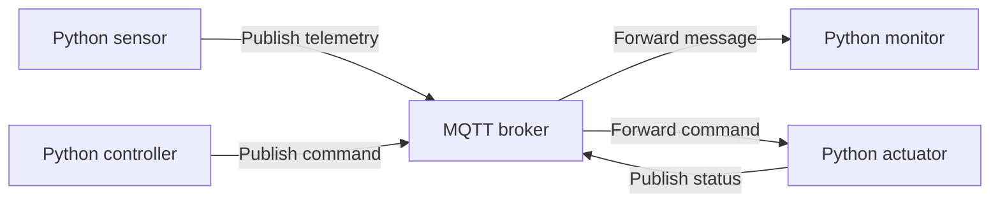
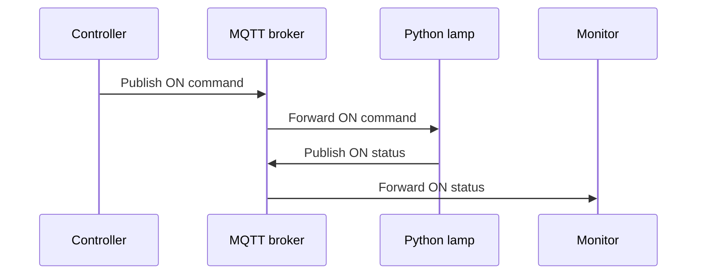

# S2 – Python Clients and MQTT Communication

## Introduction

In the previous assignment (S1), your group created a working MQTT broker. The broker can now receive messages from publishers and distribute them to subscribers.

In this assignment, Python programs are added to the system. These programs simulate intelligent devices, sensors, actuators, and monitoring applications.

The purpose is to understand the complete communication flow:



Python programs can act in different MQTT roles:

* A **sensor** publishes measurements.
* An **actuator** subscribes to commands.
* A **controller** publishes commands.
* A **monitor** subscribes to telemetry and status information.
* A single program can both publish and subscribe.

The exercises use simulated data. Physical sensors and actuators can be connected later without changing the fundamental MQTT architecture.

---

## 🎯 Learning objectives

After completing the exercises, you should be able to:

* connect a Python program to an MQTT broker;
* publish and receive MQTT messages;
* use MQTT topics systematically;
* use callbacks to process incoming messages;
* send structured data in JSON format;
* use topic wildcards;
* explain the purpose of QoS and retained messages;
* handle connection and data errors;
* simulate sensors and actuators; and
* implement two-way communication between devices.

---

# MQTT communication model

MQTT uses the **publish–subscribe model**.

A publisher does not send a message directly to another device. Instead, it publishes the message to a topic on the broker. The broker then forwards the message to every connected client that has subscribed to a matching topic.

For example:

| Role               | Action     | Topic                                 | Payload              |
| ------------------ | ---------- | ------------------------------------- | -------------------- |
| Temperature sensor | Publishes  | `devices/sensor/temperature`   | `21.7`               |
| Monitoring program | Subscribes | `devices/sensor/#`             | Receives sensor data |
| Controller         | Publishes  | `devices/actuator/lamp/set`    | `ON`                 |
| Lamp controller    | Subscribes | `devices/actuator/lamp/set`    | Receives the command |
| Lamp controller    | Publishes  | `devices/actuator/lamp/status` | `ON`                 |

---

## Recommended topic structure

```text
devices/sensor/<sensor-name>
devices/actuator/<actuator-name>/set
devices/actuator/<actuator-name>/status
devices/system/status
```

Avoid spaces, Scandinavian characters, and personally identifiable information in topic names.

---

# Preparing the Python environment

Check that Python and `pip` are available:

```bash
python3 --version
python3 -m pip --version
```

Create a project directory:

```bash
mkdir mqtt-python
cd mqtt-python
```

Create a virtual environment:

```bash
python3 -m venv .venv
source .venv/bin/activate
```

If the `venv` package is missing:

```bash
sudo apt update
sudo apt install python3-venv
```

Install the Eclipse Paho MQTT library:

```bash
python3 -m pip install paho-mqtt
```

The current Paho documentation recommends explicitly selecting callback API version 2 when creating a client.

---

## Shared configuration

Each program needs the address of your MQTT broker:

```python
BROKER = "<YOUR-BROKER-IP-ADDRESS>"
PORT = 1883
GROUP = "mqttuser"
```

Replace the example values with your group’s information.

If authentication is enabled, configure it before connecting:

```python
client.username_pw_set("username", "password")
```

Do not publish real passwords or save them in screenshots.

---

# Basic Python publisher

```python
import paho.mqtt.client as mqtt

BROKER = "192.168.1.100"
PORT = 1883
TOPIC = "devices/test"

client = mqtt.Client(
    callback_api_version=mqtt.CallbackAPIVersion.VERSION2,
    client_id="publisher"
)

client.connect(BROKER, PORT, 60)

message = "Hello from Python"
result = client.publish(TOPIC, message)

result.wait_for_publish()
print(f"Published to {TOPIC}: {message}")

client.disconnect()
```

---

# Basic Python subscriber

```python
import paho.mqtt.client as mqtt

BROKER = "192.168.1.100"
PORT = 1883
TOPIC = "devices/test"


def on_connect(client, userdata, flags, reason_code, properties):
    if reason_code == 0:
        print("Connected to the MQTT broker")
        client.subscribe(TOPIC)
        print(f"Subscribed to: {TOPIC}")
    else:
        print(f"Connection failed: {reason_code}")


def on_message(client, userdata, message):
    payload = message.payload.decode("utf-8")

    print(f"Topic: {message.topic}")
    print(f"Message: {payload}")


client = mqtt.Client(
    callback_api_version=mqtt.CallbackAPIVersion.VERSION2,
    client_id="subscriber"
)

client.on_connect = on_connect
client.on_message = on_message

client.connect(BROKER, PORT, 60)
client.loop_forever()
```

Callbacks allow the program to react to events such as connecting, disconnecting, subscribing, and receiving a message. Paho provides callbacks including `on_connect`, `on_disconnect`, `on_message`, and `on_publish`. ([Eclipse paho-mqtt documentation][2])

---

# Introductory tasks

## Task 1 – Connect Python to the broker

### Objective

Verify that a Python program can connect to your group’s MQTT broker.

### Assignment

Create a program called `connection_test.py`.

The program must:

1. create an MQTT client with a unique client ID;
2. connect to the broker;
3. print a successful connection message;
4. print an understandable error if the connection fails; and
5. disconnect cleanly.

### Expected result

```text
Connecting to 192.168.1.100...
Connected to the MQTT broker
Disconnected
```

Test at least one incorrect broker address or port. Restore the correct configuration after the test.

---

## Task 2 – Publish a text message

### Objective

Use Python as an MQTT publisher.

### Assignment

Create `publisher.py` and publish a personalized message to:

```text
devices/test
```

The message must identify the group, for example:

```text
Hello from mqttuser
```

Use `mosquitto_sub` or another Python program to verify that the broker receives and forwards the message:

```bash
mosquitto_sub -h BROKER_IP -t "devices/test" -v
```

### Expected result

```text
devices/test Hello from mqttuser
```

---

## Task 3 – Receive messages with Python

### Objective

Use a callback function to process incoming MQTT messages.

### Assignment

Create `subscriber.py`.

The program must:

* subscribe to `devices/test`;
* display the topic;
* decode and display the payload;
* display the message QoS level; and
* continue running until the user stops it.

Publish at least three different messages to the subscriber.

### Expected result

```text
Topic: devices/test
Payload: Message number 1
QoS: 0
```

---

## Task 4 – Simulate a temperature sensor

### Objective

Publish changing sensor values automatically.

### Assignment

Create `temperature_sensor.py`.

The program must:

1. generate a random temperature between 18 and 28 °C;
2. publish a new value every five seconds;
3. use the topic:

```text
devices/sensor/temperature
```

4. display every published value locally; and
5. stop cleanly when `Ctrl+C` is pressed.

Example:

```python
import random
import time

temperature = round(random.uniform(18.0, 28.0), 1)
```

### Expected result

```text
Published temperature: 21.4 °C
Published temperature: 23.1 °C
Published temperature: 20.8 °C
```

---

## Task 5 – Send structured JSON data

### Objective

Represent a sensor measurement as structured data.

### Assignment

Modify the temperature sensor so that it publishes JSON instead of a single number.

The message must contain:

* group;
* device name;
* sensor type;
* value;
* unit; and
* timestamp.

Example payload:

```json
{
  "group": "mqttuser",
  "device": "python-sensor-1",
  "sensor": "temperature",
  "value": 21.7,
  "unit": "C",
  "timestamp": "2026-09-23T09:30:00Z"
}
```

Use Python’s `json` and `datetime` modules:

```python
import json
from datetime import datetime, timezone
```

Convert the dictionary to JSON before publishing:

```python
payload = json.dumps(data)
```

Create or modify a subscriber so that it converts the received JSON back into a Python dictionary.

### Expected result

The subscriber should display meaningful fields rather than only the original JSON string:

```text
Device: python-sensor-1
Temperature: 21.7 °C
Time: 2026-09-23T09:30:00Z
```

---

## Task 6 – Monitor several sensors with wildcards

### Objective

Use MQTT wildcards to monitor several related topics.

### Assignment

Simulate three sensors:

```text
devices/sensor/temperature
devices/sensor/humidity
devices/sensor/pressure
```

Create `sensor_monitor.py` and subscribe to:

```text
devices/sensor/#
```

The `#` wildcard matches all remaining levels below the selected topic.

The monitor must display:

* the sensor name;
* the received value;
* the unit; and
* the complete MQTT topic.

### Expected result

```text
temperature: 21.8 C
humidity: 46.2 %
pressure: 1008.4 hPa
```

---

## Task 7 – Compare MQTT QoS levels

### Objective

Understand the purpose of MQTT Quality of Service.

MQTT provides three QoS levels:

| QoS | General meaning                                 |
| --: | ----------------------------------------------- |
|   0 | Deliver at most once                            |
|   1 | Deliver at least once                           |
|   2 | Deliver exactly once at the MQTT protocol level |

QoS controls how strongly the client and broker attempt to ensure delivery. Higher QoS introduces additional protocol communication and overhead. ([Eclipse Mosquitto][3])

### Assignment

Publish three messages:

```text
QoS 0 test
QoS 1 test
QoS 2 test
```

Use the same topic but a different QoS level for each message.

The publisher and subscriber must display the selected or received QoS level.

Investigate:

1. Does the subscriber receive all three messages?
2. What happens if the subscriber is started after the messages were published?
3. Does QoS alone make an earlier message available to a new subscriber?
4. Which QoS level would you choose for frequently updated temperature data?
5. Which level would you choose for an important actuator command?

Record your conclusions in comments at the end of the program.

---

## Task 8 – Use a retained status message

### Objective

Understand the difference between a normal message and a retained message.

A retained message is stored by the broker as the latest retained value for its topic. A new matching subscriber receives that value when it subscribes. ([Eclipse Mosquitto][3])

### Assignment

Create `device_status.py`.

Publish this message as a retained message:

```text
online
```

Use the topic:

```text
devices/system/status
```

Example:

```python
client.publish(TOPIC, "online", qos=1, retain=True)
```

After publishing:

1. stop the publisher;
2. start a new subscriber; and
3. observe whether it immediately receives the last status.

Then publish:

```text
offline
```

as the new retained message.

Explain why retained messages are useful for device status but could be dangerous for actuator command topics.

---

## Task 9 – Handle invalid data and connection errors

### Objective

Make an MQTT application more reliable.

### Assignment

Create a sensor-data subscriber that handles:

* invalid JSON;
* missing JSON fields;
* a payload that cannot be decoded;
* an unsuccessful broker connection; and
* an unexpected disconnection.

The program must not terminate only because one invalid message is received.

Example validation:

```python
try:
    data = json.loads(message.payload.decode("utf-8"))
    value = data["value"]
    unit = data["unit"]
except UnicodeDecodeError:
    print("The payload is not valid UTF-8")
except json.JSONDecodeError:
    print("The payload is not valid JSON")
except KeyError as error:
    print(f"Required field is missing: {error}")
```

Test the subscriber by publishing:

1. one valid JSON message;
2. one ordinary text message;
3. one JSON message without a `value` field; and
4. one JSON message with an unrealistic temperature.

The program should also reject or warn about temperatures outside a reasonable range selected by your group.

---

## Task 10 – Create a two-way intelligent device simulation

### Objective

Combine publishing, subscribing, JSON, state management, and two-way MQTT communication.

### Scenario

Create a simulated lamp that can receive commands and report its current state.



### Assignment

Create three Python programs:

1. `lamp_controller.py`
2. `lamp_device.py`
3. `lamp_monitor.py`

Use these topics:

```text
devices/actuator/lamp/set
devices/actuator/lamp/status
```

The controller must allow the user to enter:

```text
ON
OFF
EXIT
```

The lamp device must:

* subscribe to the `/set` topic;
* accept `ON` and `OFF`;
* reject invalid commands;
* maintain its current state;
* publish the new state to the `/status` topic; and
* publish its status as a retained message.

The monitor must:

* subscribe to the `/status` topic;
* show every status change; and
* show whether the message was retained.

### Expected interaction

```text
Controller command: ON
Command published: ON
```

```text
Lamp received command: ON
Lamp state changed to: ON
Status published: ON
```

```text
Lamp status: ON
Retained: False
```

Start a new monitor after changing the lamp state. It should receive the latest retained status without waiting for another command.

---

# Python, MQTT and authentication

If Mosquitto uses:

```conf
allow_anonymous false
```

every Python MQTT client must provide valid credentials before calling `connect()`.

## Basic example

```python
import paho.mqtt.client as mqtt

BROKER = "192.168.1.100"
PORT = 1883
USERNAME = "mqttuser"
PASSWORD = "replace-with-password"

client = mqtt.Client(
    callback_api_version=mqtt.CallbackAPIVersion.VERSION2,
    client_id="publisher"
)

# Authentication must be configured before connect()
client.username_pw_set(USERNAME, PASSWORD)

client.connect(BROKER, PORT, 60)
client.loop_start()

result = client.publish(
    "devices/test",
    "Hello from an authenticated Python client",
    qos=1
)

result.wait_for_publish()
print("Message published")

client.disconnect()
client.loop_stop()
```

The important order is:

```python
client.username_pw_set(USERNAME, PASSWORD)
client.connect(BROKER, PORT, 60)
```

## Subscriber example

```python
import paho.mqtt.client as mqtt

BROKER = "192.168.1.100"
PORT = 1883
USERNAME = "mqttuser"
PASSWORD = "replace-with-password"
TOPIC = "devices/#"


def on_connect(client, userdata, flags, reason_code, properties):
    if reason_code == 0:
        print("Authenticated connection established")
        client.subscribe(TOPIC)
        print(f"Subscribed to {TOPIC}")
    else:
        print(f"Connection failed: {reason_code}")


def on_message(client, userdata, message):
    payload = message.payload.decode("utf-8", errors="replace")
    print(f"{message.topic}: {payload}")


client = mqtt.Client(
    callback_api_version=mqtt.CallbackAPIVersion.VERSION2,
    client_id="mqttuser-subscriber"
)

client.username_pw_set(USERNAME, PASSWORD)

client.on_connect = on_connect
client.on_message = on_message

try:
    client.connect(BROKER, PORT, 60)
    client.loop_forever()
except KeyboardInterrupt:
    print("\nSubscriber stopped")
finally:
    client.disconnect()
```

One important security note: port `1883` normally sends the username, password, and messages without TLS encryption. This is suitable for an isolated laboratory network, but an untrusted or public network should use TLS, commonly through port `8883`.